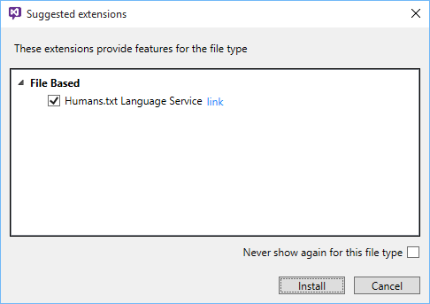
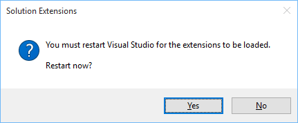
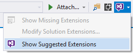
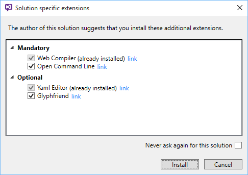
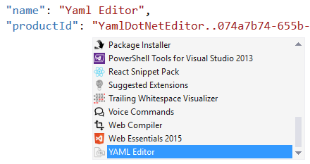

## Suggested Extensions for Visual Studio

[](https://ci.appveyor.com/project/madskristensen/solutionextensions)

Download from the
[Visual Studio Gallery](https://visualstudiogallery.msdn.microsoft.com/4e84e2cf-2d6b-472a-b1e2-b84932511379)
or get 
[nightly build](http://vsixgallery.com/extension/51b81721-cf4e-4ce0-a595-972b1ca2a186/).

## Features

- Suggested extensions
  - Suggest missing extensions for unknown files
  - Installs missing extensions easily
  - Show a list of generally suggested extension
- Solution specific extensions

## Suggested extensions

### Unknown file types

When you open a file type that Visual Studio doesn't provide
any tooling for, a yellow info bar shows up offering 1 or more
available extensions to install.


You can either chose to install one or more of these extensions
or chose not to be notified again for this particular file
type.

### Install extensions...

When clicking **Install extensions...** in the yellow info bar,
you are presented with a list of extensions for the particular
file type.



Just check the extensions you want to install and it will
be installed automatically for you. After installation a new
popup will appear to let you restart Visual Studio.



This is optional, but the newly installed extensions will not
take effect before a restart.

### Ignore file type

When clicking **Ignore file type** on the yellow info bar it
will not show again for the particular info. However, you can
still see the list of suggested extensions by clicking on a
new button on the Standard toolbar.



That will show the same dialog as before, but now it will also
include generally suggested extensions.


> To suggest new extensions for the list, please send a PR
> to [this JSON file](https://github.com/madskristensen/SolutionExtensions/blob/master/src/JSON/Schema/suggestions.json).

## Solution specific extensions

This is great for teams and open source project owners to make
sure that any needed extensions are being installed by the
developers opening and working on that solution.

### Mandatory and optional extensions

When opening a solution in Visual Studio that has already
specified which extensions the user should be using with
said solution, this dialog automatically pops up.



The user is only prompted to install extensions if any
mandatory extensions have been specified and they have not
already been installed. 

The user can always decide not to install the extensions and
even specify not to be prompted again for a specific solution.

### Specifying the solution extensions

Specifying which extensions should be used with any solution
is easy. Use the dropdown on the Standard toolbar to
modify solution extensions.


That will create a JSON file next to the solution with a 
**.vsext** extension.


The **.vsext** file must have the same name as the **.sln**
file.

After modifying the JSON file, it could look like this:

```js
{
  "extensions": {
    "mandatory": [
      {
        "name": "Web Compiler",
        "productId": "148ffa77-d70a-407f-892b-9ee542346862"
      },
      {
        "name": "Open Command Line",
        "productId": "f4ab1e64-5d35-4f06-bad9-bf414f4b3bbbNOOOOOO"
      }
    ],
    "optional": [
      {
        "name": "Yaml Editor",
        "productId": "YamlDotNetEditor..074a7b74-655b-409c-b5ac-a028f12d6e89"
      },
      {
        "name": "Glyphfriend",
        "productId": "950d05f7-bb25-43ce-b682-44b377b5307d"
      }
    ]
  }
}
```

### Intellisense

When editing the **.vsext** file you get full Intellisense
for all your installed extensions.



It even shows the extension icons to make it easy to identify
the right extensions.

> The __productId__ is the `productID` or `Identifier` found
> in an extension's `.vsixmanifest` file. With the Intellisense
> this is all automatically discovered for you.

## Contribute

The more relevant extension suggestions there are, the better
this extension becomes. Please feel free to send pull requests
with additional extensions to
[this JSON file](https://github.com/madskristensen/SolutionExtensions/blob/master/src/JSON/Schema/suggestions.json).